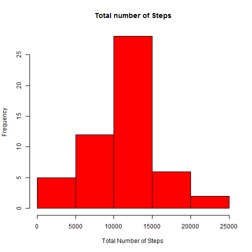
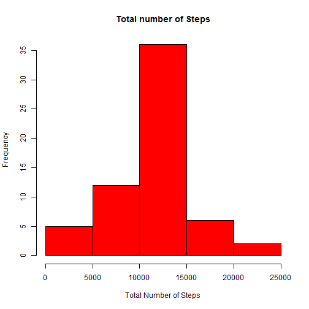
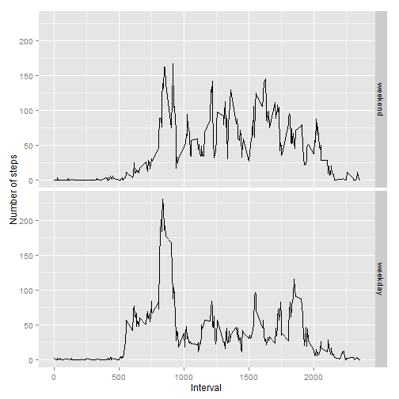

## Loading and preprocessing the data

```r
library(dplyr)
library(ggplot2)
unzip(zipfile = "activity.zip")
activity_data <- read.csv("activity.csv", header=TRUE, na.strings = "NA")
```


## What is mean total number of steps taken per day?
### Histogram of the total number of steps taken each day:

```r
steps_by_date <- activity_data %>% group_by(date) %>% summarize_each(funs(sum), -interval)
hist(steps_by_date$steps, col = "Red", xlab = "Total Number of Steps", main = "Total number of Steps")
```

 

### Mean and Median total number of steps taken per day:

```r
mean(steps_by_date$steps, na.rm = TRUE)
```

```
## [1] 10766.19
```

```r
median(steps_by_date$steps, na.rm = TRUE)
```

```
## [1] 10765
```

## What is the average daily activity pattern?
### Time series plot of the 5-minute interval (x-axis) and the average number of steps taken, averaged across all days (y-axis):

```r
avg_by_interval <- activity_data %>% group_by(interval) %>% summarize_each(funs(mean(.,na.rm=TRUE)), -date)
plot(steps ~ interval, avg_by_interval, type="l", xlab='Interval', ylab='Average number of Steps')
```

 

### On average across all the days in the dataset, the interval that contains the maximum number of steps:

```r
avg_by_interval$interval[which(avg_by_interval$steps==max(avg_by_interval$steps))]
```

```
## [1] 835
```


## Imputing missing values


### Total number of missing values in the dataset (i.e. the total number of rows with NAs):

```r
nrow(activity_data[(which(is.na(activity_data$steps))),])
```

```
## [1] 2304
```

### A new dataset that is equal to the original dataset but with the missing data filled in:
Fill the missing data with the mean values by interval

```r
activity_data_filled <- activity_data

for (i in 1:nrow(activity_data_filled))
{
  
  if (is.na(activity_data_filled$steps[i])) 
  {
    l_interval <- activity_data_filled$interval[i]
    l_mean_steps_by_interval <- avg_by_interval[which(avg_by_interval$interval == l_interval),2]
    activity_data_filled[i,1] <- l_mean_steps_by_interval
  }
  
}
```

### Histogram of the total number of steps taken each day:

```r
new_steps_by_date <- activity_data_filled %>% group_by(date) %>% summarize_each(funs(sum), -interval)
hist(new_steps_by_date$steps, col = "Red", xlab = "Total Number of Steps", main = "Total number of Steps")
```

 

### Mean and median total number of steps taken per day:

```r
mean(new_steps_by_date$steps, na.rm = TRUE)
```

```
## [1] 10766.19
```

```r
median(new_steps_by_date$steps, na.rm = TRUE)
```

```
## [1] 10766.19
```

After the missing values are filled with the mean values by interval, the mean remains the same. However, Median goes up a little bit.


## Are there differences in activity patterns between weekdays and weekends?
### A new factor variable in the dataset with two levels -- "weekday" and "weekend" indicating whether a given date is a weekday or weekend day:

```r
activity_data_filled$date <- as.Date(activity_data_filled$date, '%Y-%m-%d')
weekdaysvar <- c('Monday', 'Tuesday', 'Wednesday', 'Thursday', 'Friday')
activity_data_filled$wDay <- factor(weekdays(activity_data_filled$date) %in% weekdaysvar, levels=c(FALSE, TRUE), 
                                    labels = c('weekend', 'weekday'))
```

### Panel plot containing a time series plot of the 5-minute interval (x-axis) and the average number of steps taken, averaged across all weekday days or weekend days (y-axis):

```r
avg_by_interval_by_wday <- activity_data_filled %>% group_by(interval,wDay) %>% summarize_each(funs(mean), -date)
ggplot(avg_by_interval_by_wday, aes(interval, steps)) + geom_line() + facet_grid(wDay ~ .) + 
      xlab("Interval") + ylab("Number of steps")
```

 
